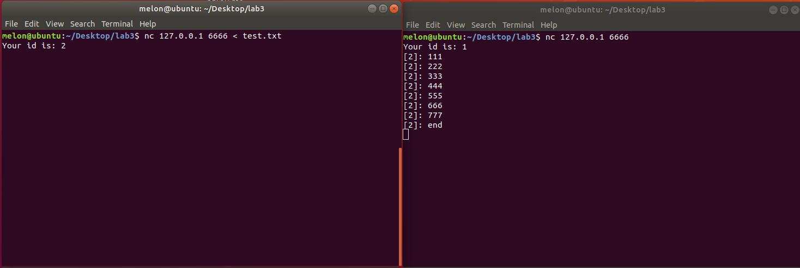
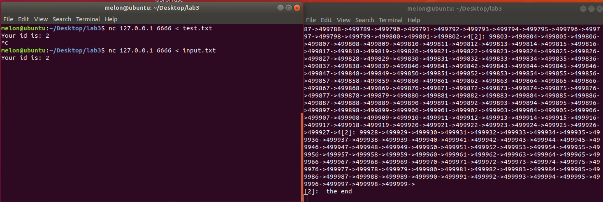
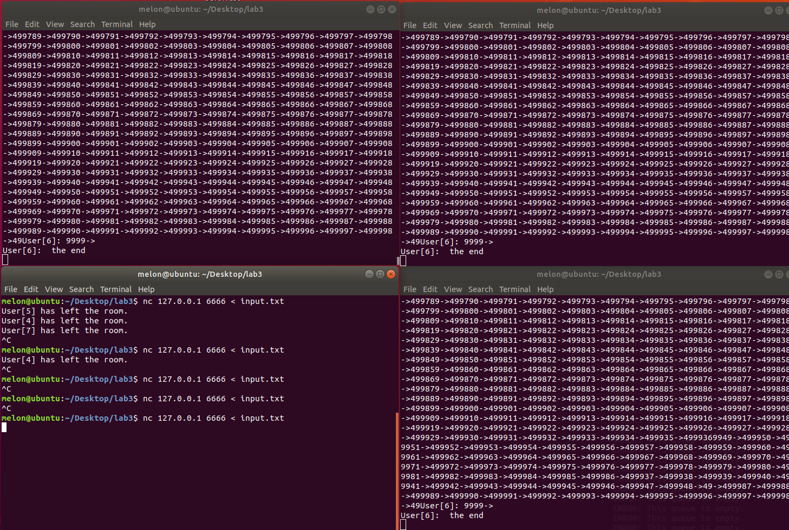

#### 双人聊天室

​			**使用  `./1 6666` 命令启动聊天室。 **  **使用 `nc 127.0.0.1 6666` 命令作为用户连接。**

##### 换行符分割测试



##### 大消息分割测试

​		如下图所示，`input.txt` 文件大小为 3Mb。使用重定向输入后可以发现所有内容都被正确发送，且没有出现错误分割。




#### 基于多线程的多人聊天室

​		**使用  `./2 127.0.0.1 6666` 命令启动聊天室。**`2.c`针对用户消息，可以做到： 根据换行符进行分割，且不会造成消息中断。修改如下的参数可以自定义消息缓冲区的大小（达到这个大小后会被强制分割）

```c
#define MAX_RECV_SIZE 100
```

​		以下的测试中，上述数值均被设置为 100。


##### 换行符分割测试

​		如下图，使用文件重定向后，所有的内容都被正确识别且依据换行符进行分割。


##### 大消息分割测试

​		如下图所示，`input.txt` 文件大小为 3Mb。使用重定向输入后可以发现所有内容都被正确发送，且没有出现错误分割。



​		

##### 细粒度锁实现

```c
pthread_mutex_lock(&mutex);
for (int i = 0; i < user_num; ++i) {
    if (users[i].id == user.id)   // Not self
        continue;
    // add the message to mesage queue
    msgQue_addmsg(&msgque[i], &msg);
}
pthread_mutex_unlock(&mutex);

// ....

pthread_mutex_lock(&mutex);        
int i = 0;
msgQue_getmsg(&msgque[t], msg);       
pthread_mutex_unlock(&mutex);
```


#### 基于 SELECT 的多人聊天室

​			**使用  `./3 127.0.0.1 6666` 命令启动聊天室。**测试过程同上，结果均为正常。

​			程序中针对每一个 fd 都进行了监测。如果是主程序的 fd，则表示需要接受 accept；如果是用户，则表示需要收发消息，进行处理即可。